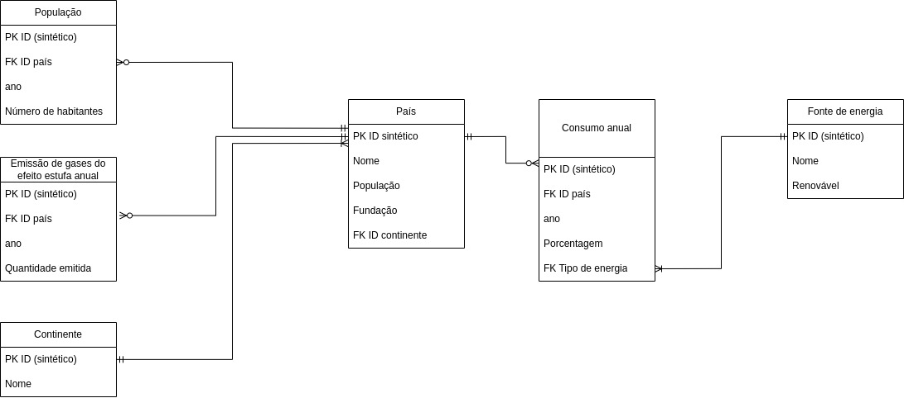

# matriz-energetica
Banco de dados que relaciona as contribuições de cada fonte de energia de um país à sua emissão de gases do efeito estufa

## Modelo Relacional

## Possíveis relações
1. Emissões de Gases do efeito estufa por quantidade por x (mil, milhão, etc) de habitantes em um período específico
2. Podemos escolher um conjunto de um ou mais países, assim como o tamanho do cj. de hab. e o período.
    1. Participação da fonte X (nuc, gases, renováveis, não renováveis, etc) na produção energética de Y países em um período.
3. Podemos unir diferentes fontes de energia de diferentes grupos de países e também variar o período
    1. Quantidade de energia produzida por fonte por quantidade X de habitantes em um grupo de países em um determinado período.P
4. Podemos relacionar o crecimento da participação de determinada fonte com o aumento ou diminuição da emissão de gases do efeito estufa

## Datasets que serão utilizados:
1.[Informações sobre energia solar](https://ourworldindata.org/grapher/solar-share-energy)  
2.[Informações sobre energia nuclear](https://ourworldindata.org/grapher/nuclear-primary-energy)  
3.[Informações sobre energia oriunda do petróleo](https://ourworldindata.org/grapher/oil-share-energy)  
4.[Informações sobre energia oriundo de carvão](https://ourworldindata.org/grapher/coal-energy-share)  
5.[Informações sobre energia oriunda de hidrelétricas](https://ourworldindata.org/grapher/hydro-share-energy)  
6.[Informações sobre energia oriunda de gás natural](https://ourworldindata.org/grapher/gas-share-energy)  
8.[Informações sobre emissão de gases do efeito estufa](https://ourworldindata.org/grapher/per-capita-ghg-emissions)
