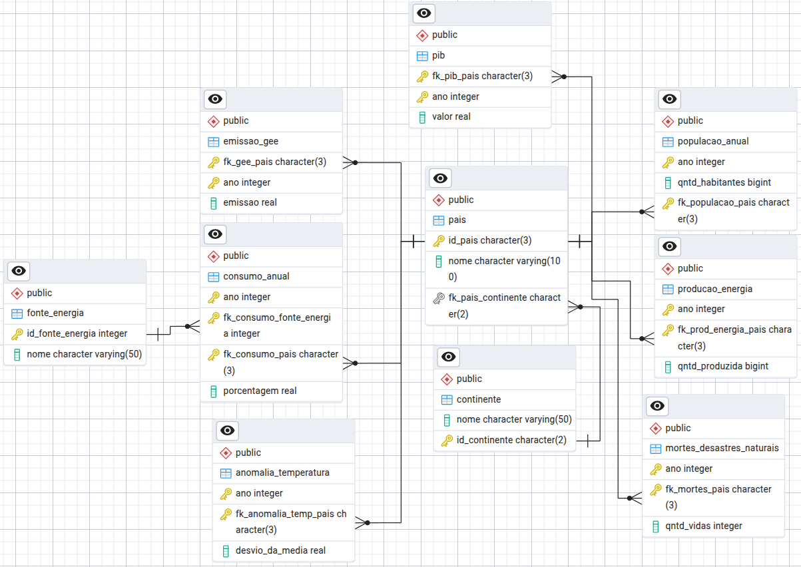

# matriz-energetica
Banco de dados relacional que contém informações sobre matriz energética, PIB, emissões de gases do efeito estufa e população de diversos países do mundo.

## Modelo Conceitual

## Modelo Relacional

## Relações Exploradas:
1. PIB anual do Brasil desde 2000
2. Top 10 maiores PIB médios desde 1990 (início dos registros)
3. Top 10 países que mais emitiram CO2 desde 1990
4. Acumulado de PIB e Toneladas de CO2 emitidas de 2020 a 2023 em cada continente e relação grama de CO2 emitido por dólar "produzido" no período
5. Top 10 países onde o consumo médio de energia nuclear mais cresceu da primeira para a segunda década do milênio

## Datasets utilizados:
1.[Informações sobre energia solar](https://ourworldindata.org/grapher/solar-share-energy)  
2.[Informações sobre energia nuclear](https://ourworldindata.org/grapher/nuclear-primary-energy)  
3.[Informações sobre energia oriunda do petróleo](https://ourworldindata.org/grapher/oil-share-energy)  
4.[Informações sobre energia oriundo de carvão](https://ourworldindata.org/grapher/coal-energy-share)  
5.[Informações sobre energia oriunda de hidrelétricas](https://ourworldindata.org/grapher/hydro-share-energy)  
6.[Informações sobre energia oriunda de gás natural](https://ourworldindata.org/grapher/gas-share-energy)  
7.[Informações sobre emissão de gases do efeito estufa](https://ourworldindata.org/grapher/per-capita-ghg-emissions)  
8.[Informações sobre a população de cada país](https://data.worldbank.org/indicator/SP.POP.TOTL?end=2023&most_recent_year_desc=false&start=1960&view=chart)
